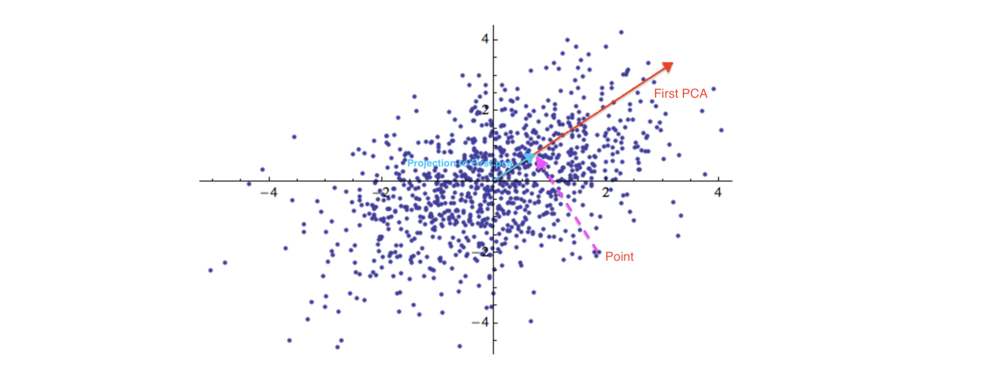

```{r setup, include=FALSE}
knitr::opts_chunk$set(echo = TRUE)
```


## Problem 1
### 1.
The picture is shown on the next page.



### 2.

####(a)
There are 10304 principle components in total.

####(b)
As $X = UDV^T$, D is a $10304\times 10304$ diagonal matrix where the diagonal element $d_1\geq d_2\geq...\geq d_{10304}\geq 0$, U is an $100\times 10304$ orthogonal matrix which $UU^T=I$, V is an $10304\times 10304$ diagonal matrix. $u_id_i$ is ith principle component under new system.
Let $$\xi_i = u_{i1}d_1$$ is the elements for the first principle component,
so $$x_iV = [u_{11}d_1,u_{21}d_1,...,u_{10304,1}d_{1}]=[\xi_1,\xi_2,...,\xi_{10304}]$$, 
and we choose to use first 48 principle component to represent x, so 
$$\hat x = \bar x + \xi_1v_1…+\xi_2v_2+...+\xi_{48}v_{48}$$
    
## Problem 2
### 1.
```{r,results='hide', message=FALSE, warning=FALSE}
library(quantmod)
library(factoextra)
symbols <- read.csv("dow.csv", header = F, stringsAsFactors = F)
nrStocks = length(symbols[,1])
z =matrix(data=NA,nrow=251,ncol=30)
colnames(z)=symbols[1:30,1]
for(i in 1:nrStocks){
  x<-getSymbols(symbols[i,1], auto.assign = F, from = "2018-01-01",
                to = "2019-01-01")[,4]
  row.names(z) <- format(index(getSymbols(symbols[i,1], 
                  auto.assign = F, from = "2018-01-01",
                  to = "2019-01-01")[,4]),"%y/%m/%d")
  z[,i]=x
}
```

### 2

```{r}
pca = princomp(z,cor=F)
```

```{r}
fviz_pca_biplot(pca, repel = F,
                col.var="contrib",
                gradient.cols = c("#00AFBB", "#E7B800", "#FC4E07"),
                col.ind = "#696969" , # Individuals color
                label="var"
                )
```


In the biplot, there are some structures:
Most companies are on the upside of the plot.
1. Companies in  chemical, natural resource and construction are located in the first quadrant.
2. Other entertainment,food, pharmacy companies are in the second quadrant.

```{r}
fviz_screeplot(pca, addlabels = TRUE)
```
There are mainly 8 dimension that are important and it contains about 95% information of the data.

### 3
```{r}
pca1 = princomp(z,cor=T)
fviz_pca_biplot(pca1, repel = F,
                col.var="contrib",
                gradient.cols = c("#00AFBB", "#E7B800", "#FC4E07"),
                col.ind = "#696969" , # Individuals color
                label="var"
                )
```

```{r}
fviz_screeplot(pca1, addlabels = TRUE)
```
In this case, the data is scaled.

#### 4
```{r}
data.now <- z[1:dim(z)[1]-1,]
data.next <- z[2:dim(z)[1],]
return <- (data.next-data.now)/data.now
pca.return = princomp(return,cor=T)
fviz_pca_biplot(pca.return, repel = F,
                col.var="contrib",
                gradient.cols = c("#00AFBB", "#E7B800", "#FC4E07"),
                col.ind = "#2E9FDF" , # Individuals color
                label="var"
                )
```

```{r}
fviz_screeplot(pca.return, addlabels = TRUE)
```

With the scree plot, we can see the first component contains almost half information of the data already. The components on the shallow slope(after component 2) contribute little to the solution. We can drop them. But is we want to contain 95% information of the data, we should keep at least the first 10 PCA.

If each stock fluctuating up and down randomly and independently for each stock,the variance perception of each compnent would be very similar. In that case, the scree plot will be quite flat and the perception of each component will be very small. So for this situation, there is no need to do PCA. It can be shown as below.

```{r}
a = runif(30*250,-1,1)
data = matrix(a,nrow=250,ncol=30)
pca.rand = princomp(data)
fviz_screeplot(pca.rand, addlabels = TRUE)

```

## Problem 3

###(1)
Suppose $s_{ij} = <x_i - \bar x, x_j - \bar x>$, $t_{ij} = <z_i-\bar z, z_j - \bar z>$,
$a_{ij} = s_{ij}-t_{ij}$
then $$(S-T)^2 = \begin{pmatrix}\sum_{i}a_{1i}  \\& \ddots & \sum_{i}a_{ni}\end{pmatrix}$$
So $$tr[(S-T)^2] = \sum_{i}\sum_{j}a_{ij}^2=\sum_{i}\sum_{j}(<x_i - \bar x, x_j - \bar x>-<z_i-\bar z, z_j - \bar z>)^2$$

###(2)
By property of trace, such that $tr[A+B]=tr[A]+tr[B]$,$tr[AB]=tr[BA]$, we know $$tr[UD^4U^T]=tr[U^TUD^4]=tr[D^4]$$. And $$tr[(UD^2U^T-\tilde U\tilde D^4 \tilde U^T)]=tr[D^4]+tr[\tilde D^4] -tr[\tilde U\tilde D^4 \tilde U^TUD^2U^T) - tr[UD^2U^T\tilde U\tilde D^4 \tilde U^T]$$ $$= 
tr[D^4]+tr[\tilde D^4] -2tr[D^2U^T\tilde U\tilde D^4 \tilde U^TU]=$$ 
$$tr[D^4+\tilde D^4-2D^2U^T\tilde U\tilde D^4 \tilde U^TU]$$

###(3)
$A = U^T \tilde U$, so $$S_c = tr[D^4+\tilde D^4 -2D^2A\tilde D^2A^T]=tr[D^4]+tr[\tilde D^4]-tr[2A^TD^2A\tilde D^2]=\sum_{j}d_j^4+\sum_{j}\tilde d_j^4-2\sum_{i}\sum_{j}a_{ij}^2d_i^2\tilde d_j^2$$,
so $$\frac{\partial S_c }{\partial \tilde d_j^2} = 2\tilde d_j^2 - 2\sum_{j}d_i^2a_{ij}^2$$ for $j =1,2...k$

###(4)
Let  $$\frac{\partial S_c }{\partial \tilde d_j^2}  = 0$$, so $$\tilde d_j^2=\sum_{j}d_i^2a_{ij}^2$$
Now, to minimize (2), we should maximize $\sum_{j}^{k}(\sum_{i}d_i^2a_{ij}^2)^2= \sum_{j}^{k}(\tilde u_j^T UD^2U\tilde u_j)^2$, as we know U is the martix with each columns are one of first k eigenvectors of matrix S.